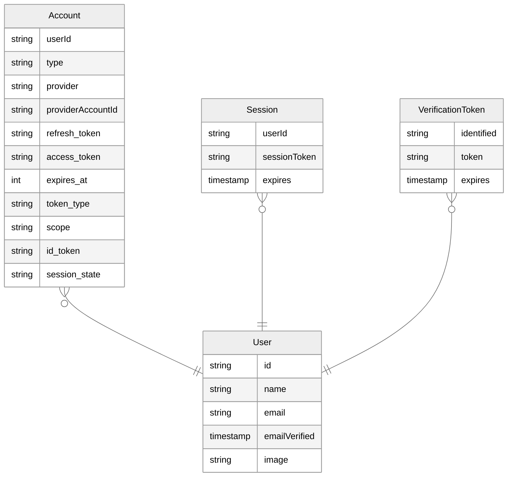

import { Callout } from "nextra/components";
import { Link } from "@/components/Link";
import manifest from "@/data/manifest.json";

# Setup a database

<Callout>
  Auth.js uses JSON Web Tokens by default for saving the user's session so **you
  don't need to setup a database for authenticating users**. However, if you
  want to persist user information in your own database, or you want to
  implement certain flows, you can use a Database Adapter.
</Callout>

\_Database Adapters\* are the bridge we use to connect to your database. For instance, [when implementing magic links](/tutorials/passwordless-sentry-setup), the `EmailProvider` will require you to setup a database adapter to be able to store the [verification tokens](/concepts/database-models#verificationtoken-model) present on the links.

This is a generic ER Diagram of what the database schema should look like. Your database adapter of
choice will include a template schema with more details for the underlying database of choice
(MySQL, PostgreSQL, etc.)

## Official adapters

Below is a list of official adapters that are distributed as their own packages under the `@auth/`
namespace. Their source code is available in the [next-auth
monorepo](https://github.com/nextauthjs/next-auth/tree/main/packages). If you're gonna setup a database, make sure you familiarise yourself [with the models Auth.js](/concepts/database-models) expects to be present.

  {Object.entries(manifest.adapters).map(([value, label]) => (
    <Link
      href={`/reference/adapter/${value}`}
      key={value}
      className="p-4 border border-solid border-slate-200 rounded-lg flex flex-col items-center justify-between w-36 shadow-lg h-32"
    >
      
      
{label}

    </Link>
  ))}

<Callout>
  If you don't find an adapter for your database or service of choice, you can
  create one yourself. Have a look at our guide on [how to create a database
  adapter](/tutorials/custom-adapter). If you create a new adapter, we'd love it
  if you created a PR to our repo to share it with everyone!
</Callout>
