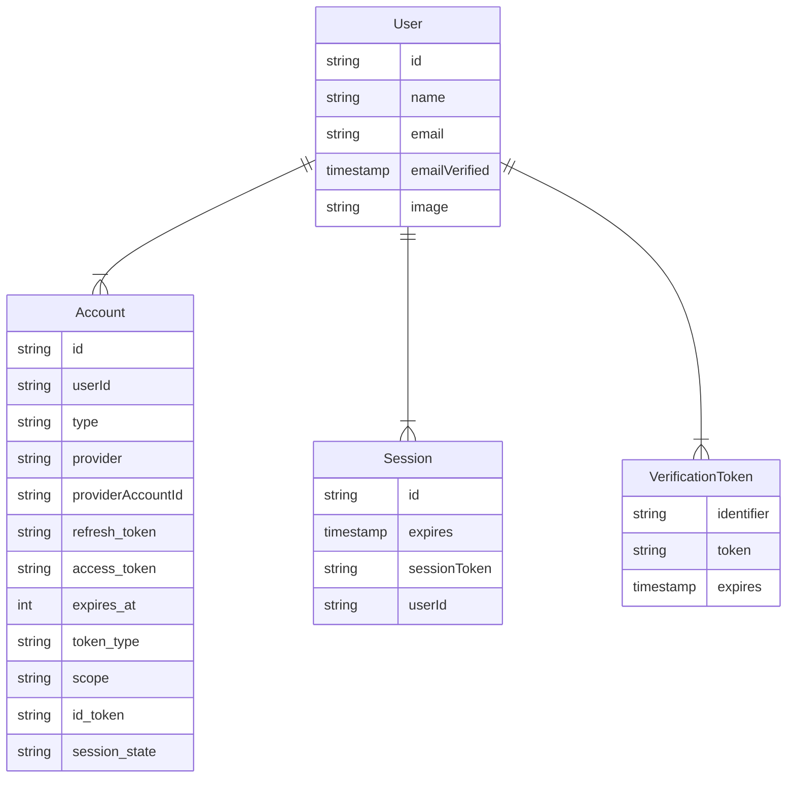

import { Callout } from "nextra/components";
import { Link } from "../../components";

# Database adapters

import manifest from "../data/manifest.json";

An **Database Adapter** in Auth.js connects your application to whatever database or backend system you use to store data for users.

**Adapters are optional**, unless you need to persist user information in your own database, or you want to implement certain flows. For instance, when implementing magic links, the [Email Provider](/getting-started/providers/email-tutorial) will require you a database adapter to be able to store [verification tokens](#verification-token) present on the links.

## Official adapters

Below you can see a list of official adapters that are distributed as their own packages under the `@auth/{name}-adapter` namespace. Their source code is available in their various adapters package directories at [`nextauthjs/next-auth`](https://github.com/nextauthjs/next-auth/tree/main/packages)

<Callout>
  If you don't find an adapter for the database or service you use, you can
  always create one yourself (and optionally open a PR so anyone can make use of
  it). Have a look at our guide on [how to create a database
  adapter](/guides/adapters/creating-a-database-adapter).
</Callout>

  {Object.entries(manifest.adapters).map(([id, [name, img]]) => (
    <Link
      href={`/reference/adapter/${id}`}
      key={id}
      className="p-4 border border-solid border-slate-200 rounded-lg flex flex-col items-center justify-between w-36 shadow-lg h-32"
    >
      
      
{name}

    </Link>
  ))}

## Database models

Auth.js can be used with any database. Models tell you what structures Auth.js expects from your database. Models will vary slightly depending on which adapter you use, but in general, will have a similar structure to the graph below. Each model can be extended with additional fields.

<Callout type="info">
  Auth.js uses `camelCase` for its database rows while respecting the
  conventional `snake_case` formatting for OAuth-related values. If the mixed
  casing is an issue for you, most adapters have a dedicated documentation
  section on how to force a casing convention.
</Callout>

---

### User model

The User model is for information such as the user's name and email address. Email address is optional, but if one is specified for a `User`, then it must be unique.

<Callout>
  User creation in the database is automatic and happens when the user is logged
  in for the first time with an authentication provider (either OAuth, magic
  links or plain credentials).
</Callout>

**OAuth sign in**

If the first sign-in is via the [OAuth Provider](/reference/core/providers/oauth), the default data saved is `id`, `name`, `email` and `image`. You can add more profile data by returning extra fields in your [OAuth provider](/guides/providers/custom-provider)'s [`profile()`](/reference/core/providers#profile) callback.

**Magic links sign in**

If the first sign-in is via the [Email Provider](/reference/core/providers/email), then the saved user will have `id`, `email`, `emailVerified`, where `emailVerified` is the timestamp of when the user was created.

### Account model

The Account model is for information about accounts associated with a `User`. A single `User` can have multiple `Account`(s), but each `Account` can only have one `User`.

<Callout>
  ACcount creation in the database is automatic and happens when the user is
  logged in for the first time with an authentication provider (either OAuth,
  magic links or plain credentials) or the
  [`Adapter.linkAccount`](/reference/core/adapters#linkaccount) method is
  invoked.
</Callout>

The default data saved is `access_token`, `expires_at`, `refresh_token`, `id_token`, `token_type`, `scope` and `session_state`. You can save other fields or remove the ones you don't need by returning them in the [OAuth provider](/guides/providers/custom-provider)'s [`account()`](/reference/core/providers#account) callback.

Linking `Accounts`(s) to `User`(s) happen automatically, only when they have the same e-mail address, and the user is currently signed in. Check the [FAQ](/concepts/faq#security) for more information on why this is a requirement.

You can manually unlink accounts if your adapter implements the
`unlinkAccount` method. Make sure to take all the necessary security steps to
avoid data loss.

### Session model

Even if you are using a database, you can still use **JWT** for session handling for fast access, in which case, this model can be opted out in your database.

- [Learn more about session strategies](/concepts/session-strategies) and their trade-offs.

The Session model is used for database sessions and it can store arbitrary data for an active user session. A single `User` can have multiple `Session`(s), each `Session` can only have one `User`.

When a Session is read, its `expires` field is checked to see if the session is still valid. If it has expired, the session is deleted from the database. You can also do this clean-up periodically in the background to avoid Auth.js
extra delete call to the database during an active session retrieval. This
might result in a slight performance increase.

### VerificationToken model

The VerificationToken model is used to store tokens for **Magic links** sign in.

A single `User` can have multiple open `VerificationToken`(s) (e.g. sign in with different devices).

<Callout>
  Due to users forgetting or failing at the sign-in flow, you might end up with
  unwanted rows in your database, that you might have to periodically clean up
  to avoid filling the database up with unnecessary data.
</Callout>

It has been designed so that it can be extended for other verification purposes in the future (e.g. 2FA / magic codes, etc... ).

Auth.js makes sure that every token is usable only once, and by default has a short lifetime (1 day, can be configured by [`maxAge`](/guides/providers/email)). If your user did not manage to finish the sign-in flow in time, they will have to start the sign-in process again.
