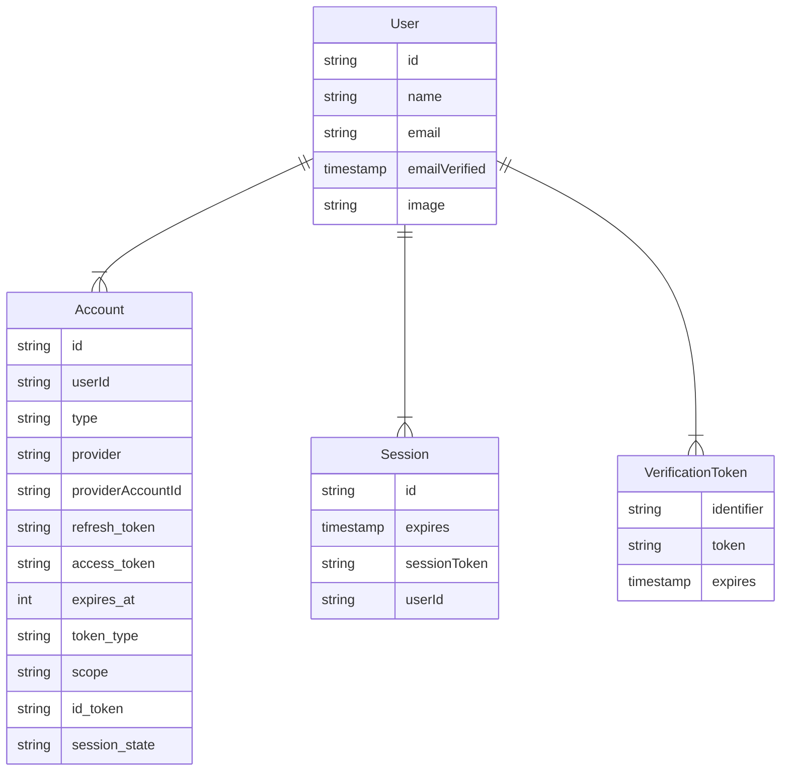

# adapters

Auth.js can be integrated with _any_ data layer (database, ORM, or backend API, HTTP client)
in order to automatically create users, handle account linking automatically, support passwordless login,
and to store session information.

This module contains utility functions and types to create an Auth.js compatible adapter.

Auth.js supports 2 session strategies to persist the login state of a user.
The default is to use a cookie + [JWT](https://authjs.dev/concepts/session-strategies#jwt)
based session store (`strategy: "jwt"`),
but you can also use a database adapter to store the session in a database.

Before you continue, Auth.js has a list of [official database adapters](https://authjs.dev/reference/core/getting-started/adapters). If your database is listed there, you
probably do not need to create your own. If you are using a data solution that cannot be integrated with an official adapter, this module will help you create a compatible adapter.

:::caution Note
Although `@auth/core` _is_ framework/runtime agnostic, an adapter might rely on a client/ORM package,
that is not yet compatible with your framework/runtime (e.g. it might rely on [Node.js APIs](https://nodejs.org/docs/latest/api)).
Related issues should be reported to the corresponding package maintainers.
:::

## Installation

```bash npm2yarn
npm install @auth/core
```

Then, you can import this submodule from `@auth/core/adapters`.

## Usage

Each adapter method and its function signature is documented in the [Adapter](adapters.md#adapter) interface.

```ts title=my-adapter.ts
import { type Adapter } from "@auth/core/adapters"

// 1. Simplest form, a plain object.
export const MyAdapter: Adapter {
 // implement the adapter methods here
}

// or

// 2. A function that returns an object. Official adapters use this pattern.
export function MyAdapter(config: any): Adapter {
 // Instantiate a client/ORM here with the provided config, or pass it in as a parameter.
 // Usually, you might already have a client instance elsewhere in your application,
 // so you should only create a new instance if you need to or you don't have one.

 return {
   // implement the adapter methods
 }
}

```

Then, you can pass your adapter to Auth.js as the `adapter` option.

```ts title=index.ts
import { MyAdapter } from "./my-adapter"

const response = await Auth(..., {
  adapter: MyAdapter, // 1.
  // or
  adapter: MyAdapter({ /* config */ }), // 2.
  ...
})
```

Note, you might be able to tweak an existing adapter to work with your data layer, instead of creating one from scratch.

```ts title=my-adapter.ts
import { type Adapter } from "@auth/core/adapters"
import { PrismaAdapter } from "@auth/prisma-adapter"
import { PrismaClient } from "@prisma/client"

const prisma = new PrismaClient()

const adapter: Adapter = {
  ...PrismaAdapter(prisma),
  // Add your custom methods here
}

const request = new Request("https://example.com")
const response = await Auth(request, { adapter, ... })
```

## Models

Auth.js can be used with any database. Models tell you what structures Auth.js expects from your database. Models will vary slightly depending on which adapter you use, but in general, will have a similar structure to the graph below. Each model can be extended with additional fields.

:::note
Auth.js / NextAuth.js uses `camelCase` for its database rows while respecting the conventional `snake_case` formatting for OAuth-related values. If the mixed casing is an issue for you, most adapters have a dedicated documentation section on how to force a casing convention.
:::



## Testing

There is a test suite [available](https://github.com/nextauthjs/next-auth/tree/main/packages/utils/adapter/index.ts)
to ensure that your adapter is compatible with Auth.js.

## Known issues

The following are missing built-in features in Auth.js but can be solved in user land. If you would like to help implement these features, please reach out.

### Token rotation

Auth.js _currently_ does not support [`access_token` rotation](https://authjs.dev/concepts/oauth#token-rotation) out of the box.
The necessary information (`refresh_token`, expiry, etc.) is being stored in the database, but the logic to rotate the token is not implemented
in the core library.
[This guide](https://authjs.dev/guides/basics/refresh-token-rotation#database-strategy) should provide the necessary steps to do this in user land.

### Federated logout

Auth.js _currently_ does not support [federated logout](https://authjs.dev/concepts/oauth#federated-logout) out of the box.
This means that even if an active session is deleted from the database, the user will still be signed in to the identity provider,
they will only be signed out of the application.
Eg. if you use Google as an identity provider, and you delete the session from the database,
the user will still be signed in to Google, but they will be signed out of your application.

If your users might be using the application from a publicly shared computer (eg: library), you might want to implement federated logout.
[This guide](https://authjs.dev/guides/providers/federated-logout) should provide the necessary steps.

## Adapter

An adapter is an object with function properties (methods) that read and write data from a data source.
Think of these methods as a way to normalize the data layer to common interfaces that Auth.js can understand.

This is what makes Auth.js very flexible and allows it to be used with any data layer.

The adapter methods are used to perform the following operations:
- Create/update/delete a user
- Link/unlink an account to/from a user
- Handle active sessions
- Support passwordless authentication across multiple devices

:::note
If any of the methods are not implemented, but are called by Auth.js,
an error will be shown to the user and the operation will fail.
:::

### Methods

#### createSession()?

```ts
optional createSession(session): Awaitable<AdapterSession>
```

Creates a session for the user and returns it.

See also [Database Session management](https://authjs.dev/guides/adapters/creating-a-database-adapter#database-session-management)

##### Parameters

• **session**: \{
  `expires`: `Date`;
  `sessionToken`: `string`;
  `userId`: `string`;
  }

• **session\.expires**: `Date`

• **session\.sessionToken**: `string`

• **session\.userId**: `string`

##### Returns

`Awaitable`\<[`AdapterSession`](adapters.md#adaptersession)\>

#### createUser()?

```ts
optional createUser(user): Awaitable<AdapterUser>
```

Creates a user in the database and returns it.

See also [User management](https://authjs.dev/guides/adapters/creating-a-database-adapter#user-management)

##### Parameters

• **user**: [`AdapterUser`](adapters.md#adapteruser)

##### Returns

`Awaitable`\<[`AdapterUser`](adapters.md#adapteruser)\>

#### createVerificationToken()?

```ts
optional createVerificationToken(verificationToken): Awaitable<undefined | null | VerificationToken>
```

Creates a verification token and returns it.

See also [Verification tokens](https://authjs.dev/guides/adapters/creating-a-database-adapter#verification-tokens)

##### Parameters

• **verificationToken**: [`VerificationToken`](adapters.md#verificationtoken)

##### Returns

`Awaitable`\<`undefined` \| `null` \| [`VerificationToken`](adapters.md#verificationtoken)\>

#### deleteSession()?

```ts
optional deleteSession(sessionToken): 
  | undefined
  | null
  | AdapterSession
  | Promise<void>
| PromiseLike<undefined | null | AdapterSession>
```

Deletes a session from the database. It is preferred that this method also
returns the session that is being deleted for logging purposes.

See also [Database Session management](https://authjs.dev/guides/adapters/creating-a-database-adapter#database-session-management)

##### Parameters

• **sessionToken**: `string`

##### Returns

   \| `undefined`   \| `null`   \| [`AdapterSession`](adapters.md#adaptersession)   \| `Promise`\<`void`\>   \| `PromiseLike`\<`undefined` \| `null` \| [`AdapterSession`](adapters.md#adaptersession)\>

#### deleteUser()?

```ts
optional deleteUser(userId): 
  | undefined
  | null
  | AdapterUser
  | Promise<void>
| PromiseLike<undefined | null | AdapterUser>
```

##### Parameters

• **userId**: `string`

##### Returns

   \| `undefined`   \| `null`   \| [`AdapterUser`](adapters.md#adapteruser)   \| `Promise`\<`void`\>   \| `PromiseLike`\<`undefined` \| `null` \| [`AdapterUser`](adapters.md#adapteruser)\>

##### Todo

This method is currently not invoked yet.

See also [User management](https://authjs.dev/guides/adapters/creating-a-database-adapter#user-management)

#### getSessionAndUser()?

```ts
optional getSessionAndUser(sessionToken): Awaitable<null | {
  session: AdapterSession;
  user: AdapterUser;
}>
```

Returns a session and a userfrom the database in one go.

:::tip
If the database supports joins, it's recommended to reduce the number of database queries.
:::

See also [Database Session management](https://authjs.dev/guides/adapters/creating-a-database-adapter#database-session-management)

##### Parameters

• **sessionToken**: `string`

##### Returns

`Awaitable`\<`null` \| \{   `session`: [`AdapterSession`](adapters.md#adaptersession);   `user`: [`AdapterUser`](adapters.md#adapteruser);   }\>

#### getUser()?

```ts
optional getUser(id): Awaitable<null | AdapterUser>
```

Returns a user from the database via the user id.

See also [User management](https://authjs.dev/guides/adapters/creating-a-database-adapter#user-management)

##### Parameters

• **id**: `string`

##### Returns

`Awaitable`\<`null` \| [`AdapterUser`](adapters.md#adapteruser)\>

#### getUserByAccount()?

```ts
optional getUserByAccount(providerAccountId): Awaitable<null | AdapterUser>
```

Using the provider id and the id of the user for a specific account, get the user.

See also [User management](https://authjs.dev/guides/adapters/creating-a-database-adapter#user-management)

##### Parameters

• **providerAccountId**: `Pick`\<[`AdapterAccount`](adapters.md#adapteraccount), `"provider"` \| `"providerAccountId"`\>

##### Returns

`Awaitable`\<`null` \| [`AdapterUser`](adapters.md#adapteruser)\>

#### getUserByEmail()?

```ts
optional getUserByEmail(email): Awaitable<null | AdapterUser>
```

Returns a user from the database via the user's email address.

See also [Verification tokens](https://authjs.dev/guides/adapters/creating-a-database-adapter#verification-tokens)

##### Parameters

• **email**: `string`

##### Returns

`Awaitable`\<`null` \| [`AdapterUser`](adapters.md#adapteruser)\>

#### linkAccount()?

```ts
optional linkAccount(account): 
  | undefined
  | null
  | AdapterAccount
  | Promise<void>
| PromiseLike<undefined | null | AdapterAccount>
```

This method is invoked internally (but optionally can be used for manual linking).
It creates an [Account](https://authjs.dev/reference/core/adapters#models) in the database.

See also [User management](https://authjs.dev/guides/adapters/creating-a-database-adapter#user-management)

##### Parameters

• **account**: [`AdapterAccount`](adapters.md#adapteraccount)

##### Returns

   \| `undefined`   \| `null`   \| [`AdapterAccount`](adapters.md#adapteraccount)   \| `Promise`\<`void`\>   \| `PromiseLike`\<`undefined` \| `null` \| [`AdapterAccount`](adapters.md#adapteraccount)\>

#### unlinkAccount()?

```ts
optional unlinkAccount(providerAccountId): undefined | AdapterAccount | Promise<void> | PromiseLike<undefined | AdapterAccount>
```

##### Parameters

• **providerAccountId**: `Pick`\<[`AdapterAccount`](adapters.md#adapteraccount), `"provider"` \| `"providerAccountId"`\>

##### Returns

`undefined` \| [`AdapterAccount`](adapters.md#adapteraccount) \| `Promise`\<`void`\> \| `PromiseLike`\<`undefined` \| [`AdapterAccount`](adapters.md#adapteraccount)\>

##### Todo

This method is currently not invoked yet.

#### updateSession()?

```ts
optional updateSession(session): Awaitable<undefined | null | AdapterSession>
```

Updates a session in the database and returns it.

See also [Database Session management](https://authjs.dev/guides/adapters/creating-a-database-adapter#database-session-management)

##### Parameters

• **session**: `Partial`\<[`AdapterSession`](adapters.md#adaptersession)\> & `Pick`\<[`AdapterSession`](adapters.md#adaptersession), `"sessionToken"`\>

##### Returns

`Awaitable`\<`undefined` \| `null` \| [`AdapterSession`](adapters.md#adaptersession)\>

#### updateUser()?

```ts
optional updateUser(user): Awaitable<AdapterUser>
```

Updates a user in the database and returns it.

See also [User management](https://authjs.dev/guides/adapters/creating-a-database-adapter#user-management)

##### Parameters

• **user**: `Partial`\<[`AdapterUser`](adapters.md#adapteruser)\> & `Pick`\<[`AdapterUser`](adapters.md#adapteruser), `"id"`\>

##### Returns

`Awaitable`\<[`AdapterUser`](adapters.md#adapteruser)\>

#### useVerificationToken()?

```ts
optional useVerificationToken(params): Awaitable<null | VerificationToken>
```

Return verification token from the database and deletes it
so it can only be used once.

See also [Verification tokens](https://authjs.dev/guides/adapters/creating-a-database-adapter#verification-tokens)

##### Parameters

• **params**: \{
  `identifier`: `string`;
  `token`: `string`;
  }

• **params\.identifier**: `string`

• **params\.token**: `string`

##### Returns

`Awaitable`\<`null` \| [`VerificationToken`](adapters.md#verificationtoken)\>

***

## AdapterAccount

An account is a connection between a user and a provider.

There are two types of accounts:
- OAuth/OIDC accounts, which are created when a user signs in with an OAuth provider.
- Email accounts, which are created when a user signs in with an [Email provider](https://authjs.dev/reference/core/providers/email).

One user can have multiple accounts.

### Extends

- [`Account`](types.md#account)

### Properties

#### provider

```ts
provider: string;
```

Provider's id for this account. Eg.: "google"

##### Inherited from

[`types.Account.provider`](types.md#provider)

#### providerAccountId

```ts
providerAccountId: string;
```

This value depends on the type of the provider being used to create the account.
- oauth/oidc: The OAuth account's id, returned from the `profile()` callback.
- email: The user's email address.
- credentials: `id` returned from the `authorize()` callback

##### Inherited from

[`types.Account.providerAccountId`](types.md#provideraccountid)

#### expires\_at?

```ts
expires_at?: number;
```

Calculated value based on [OAuth2TokenEndpointResponse.expires_in]([object Object]).

It is the absolute timestamp (in seconds) when the [OAuth2TokenEndpointResponse.access_token]([object Object]) expires.

This value can be used for implementing token rotation together with [OAuth2TokenEndpointResponse.refresh_token]([object Object]).

##### See

 - https://authjs.dev/guides/basics/refresh-token-rotation#database-strategy
 - https://www.rfc-editor.org/rfc/rfc6749#section-5.1

##### Inherited from

[`types.Account.expires_at`](types.md#expires-at)

***

## AdapterSession

A session holds information about a user's current signin state.

### Properties

#### expires

```ts
expires: Date;
```

The absolute date when the session expires.

If a session is accessed prior to its expiry date,
it will be extended based on the `maxAge` option as defined in by `SessionOptions.maxAge`.
It is never extended more than once in a period defined by `SessionOptions.updateAge`.

If a session is accessed past its expiry date,
it will be removed from the database to clean up inactive sessions.

#### sessionToken

```ts
sessionToken: string;
```

A randomly generated value that is used to look up the session in the database
when using `"database"` `AuthConfig.strategy` option.
This value is saved in a secure, HTTP-Only cookie on the client.

#### userId

```ts
userId: string;
```

Connects the active session to a user in the database

***

## AdapterUser

A user represents a person who can sign in to the application.
If a user does not exist yet, it will be created when they sign in for the first time,
using the information (profile data) returned by the identity provider.
A corresponding account is also created and linked to the user.

### Extends

- [`User`](types.md#user)

### Properties

#### email

```ts
email: string;
```

The user's email address.

##### Overrides

`User.email`

#### emailVerified

```ts
emailVerified: null | Date;
```

Whether the user has verified their email address via an [Email provider](https://authjs.dev/reference/core/providers/email).
It is `null` if the user has not signed in with the Email provider yet, or the date of the first successful signin.

#### id

```ts
id: string;
```

A unique identifier for the user.

##### Overrides

`User.id`

***

## VerificationToken

A verification token is a temporary token that is used to sign in a user via their email address.
It is created when a user signs in with an [Email provider](https://authjs.dev/reference/core/providers/email).
When the user clicks the link in the email, the token and email is sent back to the server
where it is hashed and compared to the value in the database.
If the tokens and emails match, and the token hasn't expired yet, the user is signed in.
The token is then deleted from the database.

### Properties

#### expires

```ts
expires: Date;
```

The absolute date when the token expires.

#### identifier

```ts
identifier: string;
```

The user's email address.

#### token

```ts
token: string;
```

A [hashed](https://authjs.dev/concepts/hashing) token, using the `AuthConfig.secret` value.
